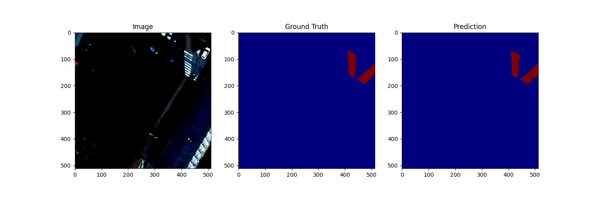
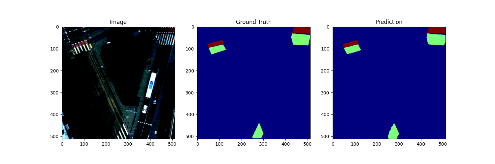
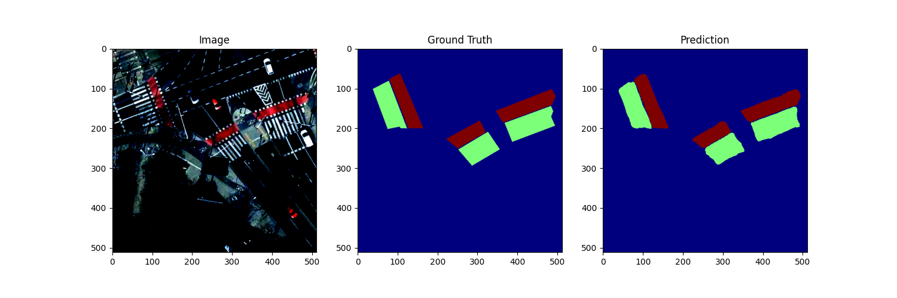
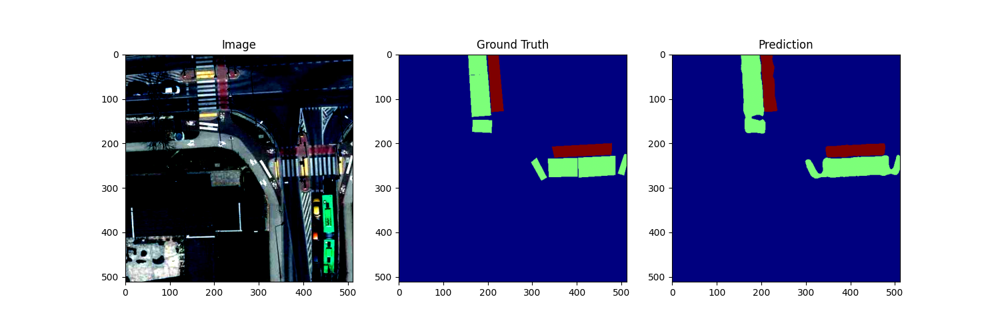
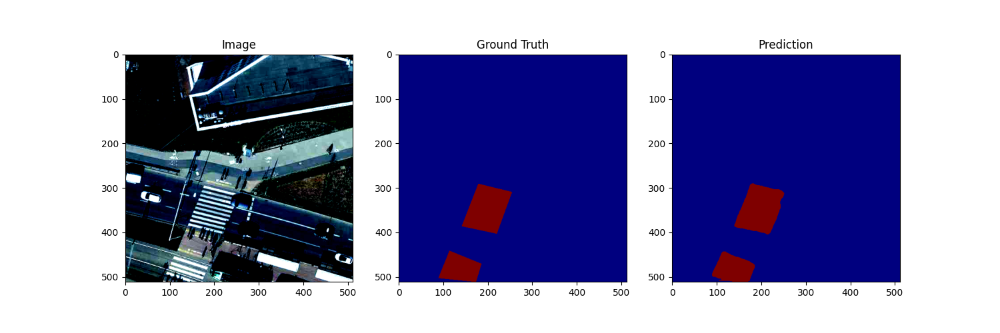
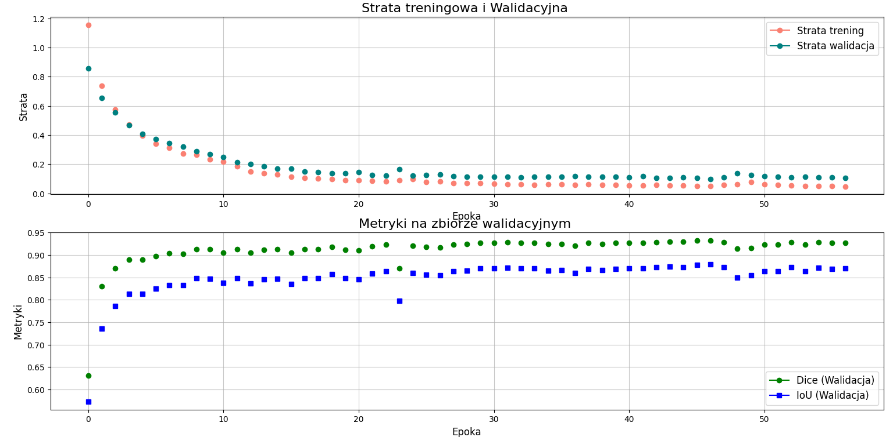

# Model for pedestrian and bicycle crossings segmentation in QGIS

## Dependencies for training

The following dependencies are required to train the model:
- install PyTorch (https://pytorch.org/get-started/locally/) - check the proper version for your system,
- install requirements from `requirements.txt` file:
```bash
pip install -r requirements.txt
```
- to use the Segformer model, upgrade the library with:
```bash
pip install --upgrade git+https://github.com/qubvel/segmentation_models.pytorch
```

## Data

The data are aerial images from the [Poznan 2022 aerial orthophoto high resolution](https://qms.nextgis.com/geoservices/5693/) map available in QGIS.
The images were created with the [Deepness plugin](https://plugins.qgis.org/plugins/deepness/), with the following parameters:
- `Resolution [cm/px]`: 10.00
- `Tile size [px]`: 512
- `Batch size`: 1
- `Tile overlap [%]`: 10

The images come from the following locations:
- 0 - 348 - PUT Campus and surrounding areas,
- 349 - 449 - Plewiska and Komorniki,
- 450 - 497 - Skórzewo,
- 498 - 520 - Ławica and Junikowo,
- 521 - 595 - Sołacz, Winiary, and South-Western Podolany ,
- 596 - 795 - Grunwald, Górczyn, Łazarz (from [https://universe.roboflow.com/zpo/pedestrian_bicycle_crossings](https://universe.roboflow.com/zpo/pedestrian_bicycle_crossings))*,
- 796 - 842 - Sejny (North-Eastern Poland) - from Geoportal Polska Orthophoto Poland,
- 843 - 945 - Żegrze (from [https://universe.roboflow.com/obraz/obrazy](https://universe.roboflow.com/obraz/obrazy))*,
- 946 - 1057 - Wilda and Dębiec (from [https://universe.roboflow.com/obrazy-tisrw/obrazy-kublo](https://universe.roboflow.com/obrazy-tisrw/obrazy-kublo))*,
- 1058 - 1385 - Winogrady and Szeląg (from [https://universe.roboflow.com/zpo/pedestrian_bicycle_crossings](https://universe.roboflow.com/zpo/pedestrian_bicycle_crossings))*.

\* Images from the Roboflow platform were adjust to be in the same format as the images from CVAT. Additionally, they were checked for mistakes in the annotations, and if necessary, they were corrected.

Installing package 
```bash
pip install -e .
```

## UNet++ (EfficientNet-B0):
```bash
python scripts/run_training.py --model unet_effb0

```
## UNet++ (ResNet-34)

```bash
python scripts/run_training.py --model unet_resnet34
```
## UNet++ (MobileNetV2)
```bash
python scripts/run_training.py --model unet_mobilenetv2 
```
## DeepLabV3 (ResNet-34):
```bash
python scripts/run_training.py --model deeplabv3_resnet34 
```
## Evaluation model 
```bash
python scripts/run_evaluation.py --model unet_effb0 --checkpoint checkpoints/<checkpoint_folder>/best-checkpoint.ckpt --format ckpt --num_samples 5
```
Example
```bash
python scripts/run_evaluation.py --model deeplabv3plus_resnet34 --checkpoint checkpoints/run_20250105-144034/best-checkpoint.ckpt --format ckpt --num_samples 10  --batch_size 4
```

## Visualization predictions results







## Visualization metrics results
