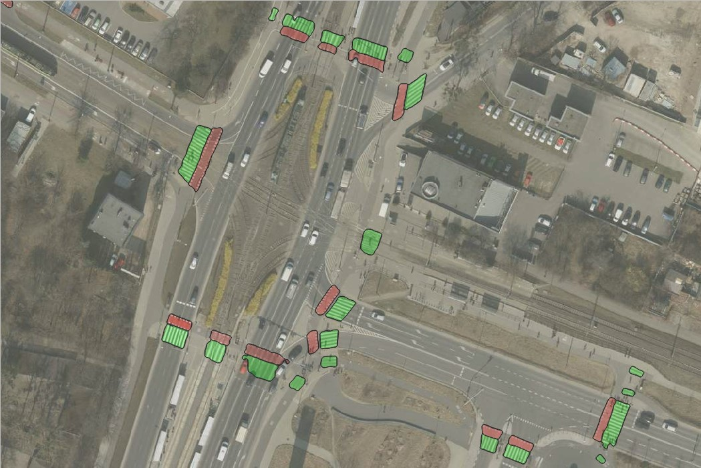

# Model for pedestrian and bicycle crossings segmentation in QGIS


<!-- TOC -->
* [Model for pedestrian and bicycle crossings segmentation in QGIS](#model-for-pedestrian-and-bicycle-crossings-segmentation-in-qgis)
  * [Model](#model)
  * [Data](#data)
  * [Dependencies for training](#dependencies-for-training)
  * [How to train the model](#how-to-train-the-model)
    * [Segformer (ResNet-50):](#segformer-resnet-50)
  * [Model evaluation](#model-evaluation)
  * [Training process and metrics on the test set](#training-process-and-metrics-on-the-test-set)
  * [Predicted results](#predicted-results)
    * [Poznan 2022 aerial orthophoto high resolution (the map that was used to create training set)](#poznan-2022-aerial-orthophoto-high-resolution-the-map-that-was-used-to-create-training-set)
    * [Poznan 2022 (almost) whole city statistics](#poznan-2022-almost-whole-city-statistics)
    * [Poznan 2023 aerial orthophoto high resolution (the map was **not** used to create training set)](#poznan-2023-aerial-orthophoto-high-resolution-the-map-was-not-used-to-create-training-set)
    * [Poznan 2022 aerial orthophoto high resolution (places that are not perfect)](#poznan-2022-aerial-orthophoto-high-resolution-places-that-are-not-perfect)
  * [Demo instructions and video](#demo-instructions-and-video)
  * [People](#people)
  * [Extras:](#extras)
    * [Training other models](#training-other-models)
<!-- TOC -->

## Model

The model is based on Segformer architecture with ResNet-50 backbone. The model was exported to onxx format and can be downloaded from the [onnx_model](onnx_model) folder.

## Data

The data are aerial images from the [Poznan 2022 aerial orthophoto high resolution](https://qms.nextgis.com/geoservices/5693/) map available in QGIS.
The images were created with the [Deepness plugin](https://plugins.qgis.org/plugins/deepness/), with the following parameters:
- `Resolution [cm/px]`: 10.00
- `Tile size [px]`: 512
- `Batch size`: 1
- `Tile overlap [%]`: 10

The images come from the following locations:
- 0 - 348 - PUT Campus and surrounding areas,
- 349 - 449 - Plewiska and Komorniki,
- 450 - 497 - Skórzewo,
- 498 - 520 - Ławica and Junikowo,
- 521 - 595 - Sołacz, Winiary, and South-Western Podolany ,
- 596 - 795 - Grunwald, Górczyn, Łazarz (from [https://universe.roboflow.com/zpo/pedestrian_bicycle_crossings](https://universe.roboflow.com/zpo/pedestrian_bicycle_crossings))*,
- 796 - 842 - Sejny (North-Eastern Poland) - from Geoportal Polska Orthophoto Poland,
- 843 - 945 - Żegrze (from [https://universe.roboflow.com/obraz/obrazy](https://universe.roboflow.com/obraz/obrazy))*,
- 946 - 1057 - Wilda and Dębiec (from [https://universe.roboflow.com/obrazy-tisrw/obrazy-kublo](https://universe.roboflow.com/obrazy-tisrw/obrazy-kublo))*,
- 1058 - 1385 - Winogrady and Szeląg (from [https://universe.roboflow.com/zpo/pedestrian_bicycle_crossings](https://universe.roboflow.com/zpo/pedestrian_bicycle_crossings))*.

\* Images from the Roboflow platform were adjust to be in the same format as the images from CVAT. Additionally, they were checked for mistakes in the annotations, and if necessary, they were corrected.

## Dependencies for training

The following dependencies are required to train the model:
- install PyTorch (https://pytorch.org/get-started/locally/) - check the proper version for your system,
- install requirements from `requirements.txt` file:
```bash
pip install -r requirements.txt
```
- to use the Segformer model, upgrade the library with:
```bash
pip install --upgrade git+https://github.com/qubvel/segmentation_models.pytorch
```
- install the package 
```bash
pip install -e .
```

## How to train the model

The training script allows you to train models with different architectures and backbones. The command to run training of the final model is listed below, and commands for other models are available in the [Extras](#extras).

### Segformer (ResNet-50):
```bash
python scripts/run_training.py --model segformer_resnet50 
```

## Model evaluation
```bash
python scripts/run_evaluation.py --model unet_effb0 --checkpoint checkpoints/<checkpoint_folder>/best-checkpoint.ckpt --format ckpt --num_samples 5
```
Example
```bash
python scripts/run_evaluation.py --model deeplabv3plus_resnet34 --checkpoint checkpoints/run_20250105-144034/best-checkpoint.ckpt --format ckpt --num_samples 10  --batch_size 4
```

## Training process and metrics on the test set


## Predicted results

The model is overall working really well (what's confirmed by the metrics on the test dataset), and it works properly on different maps, that were not used for training.

Very rarely the model is not cutting out cars (specifically black or white cars are problematic) or is missing some old faded paint (some of the missed crossings are even hard to spot for human, so it's not missing the obvious ones).

### Poznan 2022 aerial orthophoto high resolution (the map that was used to create training set)





### Poznan 2022 (almost) whole city statistics

Just from curiosity the model was run on majority of Poznań at once to capture statistics about the percentage of are covered with pedestrian/bike crossings.


### Poznan 2023 aerial orthophoto high resolution (the map was **not** used to create training set)


### Poznan 2022 aerial orthophoto high resolution (places that are not perfect)


## Demo instructions and video


To reproduce the results use the `Poznan 2022 aerial orthophoto high resolution` map and the model from the [onnx_model](onnx_model) folder. You can zoom-in at the intersections from the gif, or use any other location.

## People

The model was prepared by:
- [Daria Kubacka](https://github.com/dariak153)
- [Marcin Czajka](https://github.com/mmcza)
- [Mateusz Grudziński](https://github.com/MateuszGrudzinski)

## Extras:

### Training other models
To train other models you can try the following commands

#### FPN (ResNet-34):
```bash
python scripts/run_training.py --model fpn_resnet34 
```
#### UNet (EfficientNet-B0):
```bash
python scripts/run_training.py --model unet_effb0
```
#### UNet (ResNet-34)
```bash
python scripts/run_training.py --model unet_resnet34
```
#### UNet (MobileNetV2)
```bash
python scripts/run_training.py --model unet_mobilenetv2 
```
#### DeepLabV3 (ResNet-34):
```bash
python scripts/run_training.py --model deeplabv3_resnet34 
```